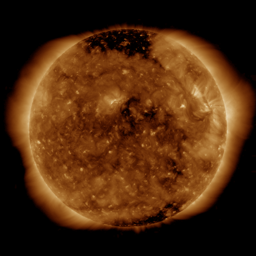
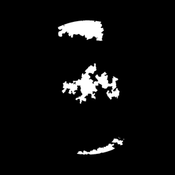
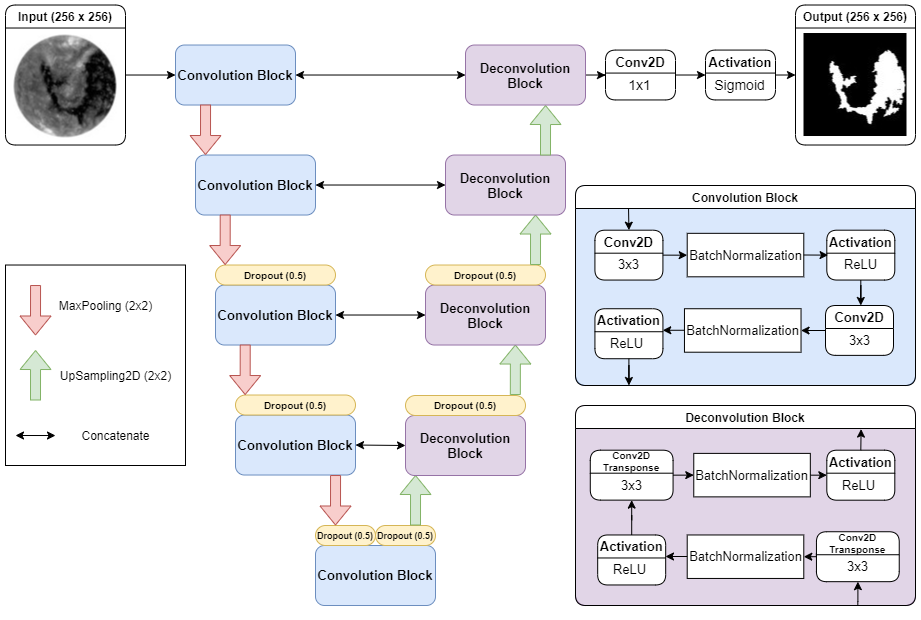
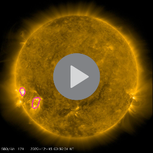
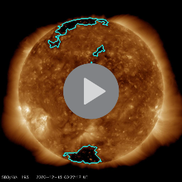

# Solar corona structures segmentation by deep learning

Segmentation of coronal holes and active regions using SDO/AIA images.

## Folders and files
- data
    - [ar_custom.zip](https://github.com/matinus99/sun-segmentation/blob/main/data/ar_custom.zip) - Contains files of manually annotated active regions.  
    - [ch_custom.zip](https://github.com/matinus99/sun-segmentation/blob/main/data/ch_custom.zip) - Contains files of manually annotated coronal holes. 
    - [sample_data.zip](https://github.com/matinus99/sun-segmentation/blob/main/data/sample_data.zip) - Contains 100 193Å images + CH binary masks and 100 171Å + AR binary masks.
- notebooks
    - [ar_segmentation.ipynb](https://github.com/matinus99/sun-segmentation/blob/main/notebooks/ar_segmentation.ipynb) - Segmentation of active regions.
    - [ch_segmentation.ipynb](https://github.com/matinus99/sun-segmentation/blob/main/notebooks/ch_segmentation.ipynb) - Segmentation of coronal holes.
    - [data_custom.ipynb](https://github.com/matinus99/sun-segmentation/blob/main/notebooks/data_custom.ipynb) - Downloading images and creating binary masks based on coordinates in `ar_custom.zip` and `ch_custom.zip`.
- src
    - [metrics.py](https://github.com/matinus99/sun-segmentation/blob/main/src/metrics.py) - Dice and IoU metrics.
    - [model_scss_net.py](https://github.com/matinus99/sun-segmentation/blob/main/src/model_scss_net.py) - Segmentation model called by function `scss_net`.
    - [prep_utils.py](https://github.com/matinus99/sun-segmentation/blob/main/src/prep_utils.py) - Data preparation utilities.
    - [utils.py](https://github.com/matinus99/sun-segmentation/blob/main/src/utils.py) - Utilities for plotting. 

## Libraries
List of all used libraries can be found in [requirements.txt](https://github.com/matinus99/sun-segmentation/blob/main/requirements.txt) file. 
- [Albumentations](https://github.com/albumentations-team/albumentations) - library used for data augmentations.
- [ImageDataAugmentor](https://github.com/mjkvaak/ImageDataAugmentor) - library that extends base Keras ImageDataGenerator and allows use of custom augmentations

## Data
Data used for training and trained models can be found on this [link](https://mega.nz/folder/hTp3QAiZ#W8DM6rF8Wx7eNYs5mcU9zA).

The training data were images of the sun ([SDO AIA](https://sdo.gsfc.nasa.gov/)) and a corresponding binary mask of 
a specific region 
(a coronal hole or active region).

 

### Data sources
You can download images with [HEK API](https://www.lmsal.com/hek/api.html) or with 
[SunPy module](https://docs.sunpy.org/en/stable/guide/acquiring_data/hek.html). Additional data sources can be found below:

#### Images

- https://sdo.gsfc.nasa.gov/data/
- https://suntoday.lmsal.com/suntoday/
- http://jsoc.stanford.edu/

#### Annotations
- [CHIMERA](https://solarmonitor.org/data/)
- [Region Growth](https://github.com/observethesun/coronal_holes/tree/mnras2018/data)
- [SPoCA](https://www.lmsal.com/hek/api.html)

## SCSS - Solar coronal structures segementation model
SCSS model is based on [U-Net](https://arxiv.org/abs/1505.04597) architecture used for segmentation of biomedical images. Image below shows how SCSS model architecture.

## Videos (External)
Clicking on image opens video uploaded on YouTube.

